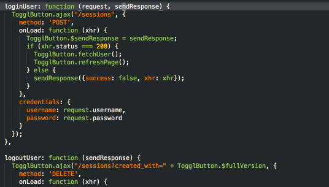
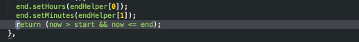
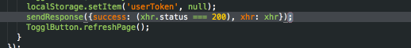
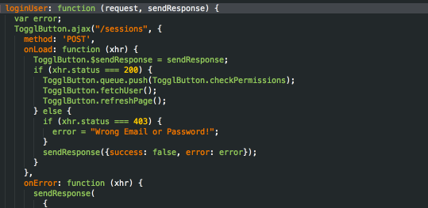
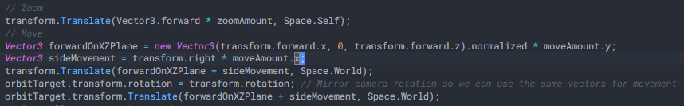

# LogMagic for Visual Studio Code

Easily print variables and parameters with keyboard shortcuts for quick debugging.

### Supported Languages

- Javascript
- Typescript
- C#

## Features

### Log Quickly

Log variables on the current line with a keyboard shortcut.

Just hit `alt+j` and let LogMagic do the work.



### Up / Down Support

You can also log upwards with `alt+k`. This is especially helpful when you want to inspect
return statements.



### Cycle Through Different Kinds of Log Statements

Press the same keyboard shortcuts when already on a log statement to cycle through different kinds of log statements.
In javascript for example you can cycle through `log`, `info`, `warn` and `error` levels. In C# you can cycle through
`System.WriteLine`, `System.Write` and Unity's `Debug.Log` options.



### Remove All Log Statements

Pressing `ctrl + alt + j` (or `cmd + alt + j` on a mac) removes all log statements from the current file.



### If Nothing to Log, Print the Line Number

If LogMagic can't find anything meaningful to log it falls back to printing `L<line number>`.
It always puts your caret at the end of the generated log statement for easy manual additions if needed.

### Customize

You can use the `logMagig.logFormats` configuration to create your own log statements to cycle through for each language / workspace / resource. You can even wrap logged identifiers in your own decorator functions or append `.toString()` for example.

**Note:** it might still work for unsupported languages as well. You can use the extension settings to specify a default language that will define how it parses code and override the shape of the log statement for that language. The only way that it should ever "fail" is in determining what is and what is not an interesting variable to output. If the language is similar to any of the supported languages, it might work well enough.

### For Unity C# Development



You can hit `alt + j` 3 times to cycle through C# statements variants until you get to `Debug.Log`.

If you want to fully switch over to Unity style logging (like in the gif above), you can add the following to your configuration. You can do this on a User, Workspace or even Folder level.

```json
{
  "[csharp]": {
    "logMagic.logFormats": [
        {
            "logPrefix": "Debug.Log(",
            "parameterSeparator": " + ",
            "identifierPrefix": "",
            "identifierSuffix": "",
            "logSuffix": ");",
            "quoteCharacter": "\"",
            "insertSpaces": true
        },
        {
            "logPrefix": "Debug.LogWarning(",
            "parameterSeparator": " + ",
            "identifierPrefix": "",
            "identifierSuffix": "",
            "logSuffix": ");",
            "quoteCharacter": "\"",
            "insertSpaces": true
        },
        {
            "logPrefix": "Debug.LogError(",
            "parameterSeparator": " + ",
            "identifierPrefix": "",
            "identifierSuffix": "",
            "logSuffix": ");",
            "quoteCharacter": "\"",
            "insertSpaces": true
        }
    ]
  }
}
```

## Extension Settings

This extension contributes the following settings:

- `logMagic.defaultLanguage`: Specifies the language to fall back to if LogMagic does not have a direct implementation for the currently active programming language
- `logMagic.logFormats`: An array of log formats. With this you can override the log formats on a global or per-language level. Each log format should be an object with the following string properties:
  - `logPrefix`: A log-function call including the opening parenthesesis like _print(_
  - `parameterSeparator`: A parameter separator, like a comma
  - `identifierPrefix`: Anything to prefix each identifier with. You can use this along with _identifierSuffix_ to wrap identifiers in decorator functions for example.
  - `identifierSuffix`: Anything to suffix identifiers with. You can call _.toString()_ on each identifier for example.
  - `logSuffix`: An ending suffix to complete the log statement, like _);_. The caret is placed right before the suffix by default.
  - `quoteCharacter`: The quote character to use when outputting strings.
  - `insertSpaces`: A boolean indicating whether logged strings should be wrapped in spaces for padding.

## Limitations

It does not know types or the semantics behind variables and parameters so it is not smart enough to avoid logging functions or other non-human-readable data. Consider it a helper, rather than a perfect tool for generating log statements.

## Notes for Publishing

Because I can never remember what I need to do and I spend an hour trying to find where I can regenerate a new Personal Access Token.
1. Guide is here: https://code.visualstudio.com/api/working-with-extensions/publishing-extension
2. Update changelog
3. Run `vsce publish [major|minor|patch]`. It will automatically bump the version & make a commit + tag
4. If token expired: go to https://dev.azure.com/iamsyko => upper left corner => generate a new PAT with permissions Marketplace > Manage.

## Release Notes

See CHANGELOG.md